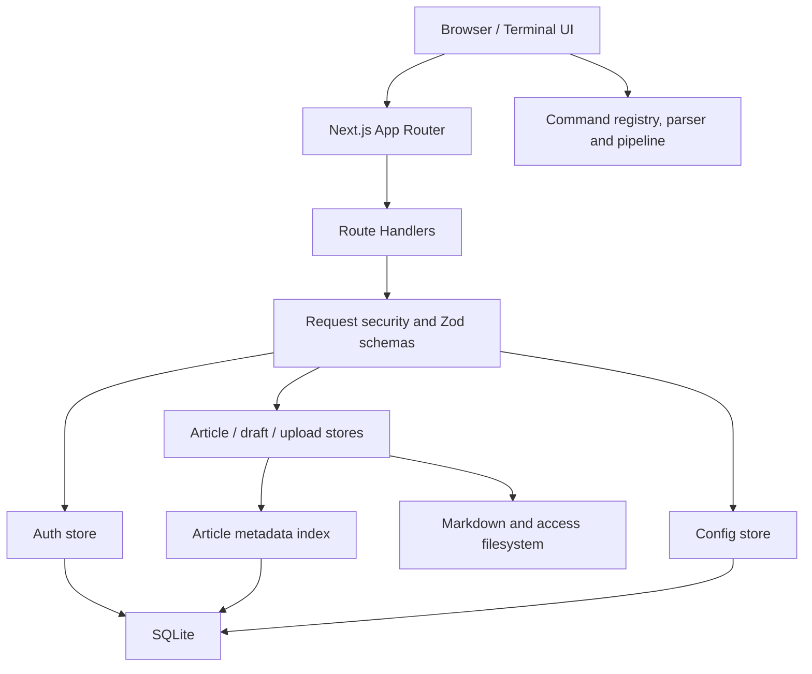

<div align="center">
  
  <h1 style="margin-top: 0">Terminal Blog</h1>
</div>

<div align="center">
  

**English** | [简体中文](./README.md)

    
</div>

Terminal Blog is a blog system whose primary interface is an actual terminal workspace. It does not place a command-line theme around a conventional web page. Articles, categories, drafts, attachments, configuration, and administrative operations are exposed through a Unix-like filesystem and command model.

Visitors browse with `ls`, `cd`, `cat`, `less`, `head`, `tail`, `grep`, and pipelines. Administrators use `su root` or `sudo` together with an in-terminal `nano` editor, draft management, uploads, moves, and removals.

```shell
Terminal Blog Shell 2.6.0 (tty/07)
Copyright (c) 2026 Terminal Blog. All signals preserved.
Last login: Fri Aug 15 04:42:07 from public.gateway

guest@terminal.blog:~ $ cd systems
guest@terminal.blog:~/systems $ ls
-r--r--r-- 2026-08-12  6 min packet-garden.md
guest@terminal.blog:~/systems $ cat packet-garden render
```

## Why Terminal Blog

Terminal Blog is designed for two audiences at once. Experienced terminal users get a continuous, composable workflow, while visitors unfamiliar with command-line tools still receive prediction, completion, parameter hints, help output, and an optional collapsible file tree.

| Design                       | Implementation and benefit                                                                                                       |
| ---------------------------- | -------------------------------------------------------------------------------------------------------------------------------- |
| Terminal-only workspace      | There is no traditional header, footer, or fixed command bar. The prompt remains at the end of the scrollback buffer             |
| Composable commands          | A central registry generates help, argument descriptions, and completions; text commands support pipelines such as `cat \| grep` |
| Large-buffer performance     | TanStack Virtual mounts only visible output entries plus a small overscan window                                                 |
| On-demand CJK font loading   | Maple Mono is split into 46 `unicode-range` WOFF2 files, so the browser downloads only glyph ranges used on the page             |
| In-terminal editing          | `nano` and `less` use an alternate-screen model and restore scrollback when closed instead of opening web modals                 |
| Files and index are separate | Markdown files remain the source of truth; SQLite indexes metadata without duplicating article bodies                            |
| Safer Markdown               | React Markdown disables raw HTML, Remark GFM adds common extensions, and Shiki is loaded dynamically for dual-theme highlighting |
| Revocable authentication     | Root sessions are stored server-side with password versions and revocation instead of non-revocable signed tokens                |
| Deployment configuration     | Blog identity, title templates, links, filing records, icons, and the cookie notice share one configuration model                |

## Terminal Experience

### Input model

- `/` opens the command menu, single-letter input predicts commands, `Tab` completes, and arrow keys navigate suggestions and history.
- `Insert` switches between insert and overwrite cursor modes.
- Password input echoes neither characters nor password length.
- Terminal-style copy and paste use `Ctrl+Shift+C`, `Ctrl+Shift+V`, and middle-click paste.
- A custom context menu provides copy, paste, paste selection, select all, and clear.
- `clear` recreates the session output while preserving the boot copyright text and a fresh prompt.

### Virtual scrollback

The scrollback uses `@tanstack/react-virtual` with stable entry IDs, live DOM height measurement, an initial estimate of roughly `52px`, and `8` overscan items.

As command history, Markdown, screenfetch data, and article output grow, the browser does not keep every output node mounted. Only entries around the viewport are rendered. The prompt can still remain at the logical end of the buffer, and closing `nano` or `less` restores the previous scroll position.

### Maple Mono Unicode sharding

The full Maple Mono CJK font is too large for a smooth first load. Terminal Blog splits it into 46 WOFF2 resources:

- The ASCII shard is about 34 KB and is preloaded during application startup.
- Latin Extended, symbols, CJK punctuation, and full-width characters use separate shards.
- CJK Unified Ideographs are divided into ranges of roughly 512 code points, such as `U+4E00-4FFF` and `U+5000-51FF`.
- All shards total about 6.4 MB, but a browser requests only ranges required by characters currently rendered.

Declarations live in [`app/maple-mono.css`](./app/maple-mono.css), while the WOFF2 files live under `public/fonts/maple-mono/`. This avoids loading the entire font before first paint while preserving consistent Chinese and Latin typography.

### Markdown and syntax highlighting

- `react-markdown` renders React output without a Vue or external rendering runtime.
- `remark-gfm` adds tables, strikethrough, task lists, and autolinks.
- `skipHtml` prevents raw article HTML from being rendered.
- The Shiki Web Bundle is dynamically imported only when a fenced code block is present.
- Shiki generates both `github-light` and `github-dark` colors and follows the terminal theme.
- Images are lazy-loaded, and safe relative article paths can resolve into the whitelisted `access/` directory.

## Technology Stack

| Layer          | Technology                               |
| -------------- | ---------------------------------------- |
| Web framework  | Next.js 16 App Router, React 19          |
| Language       | TypeScript 5 with `strict: true`         |
| UI and styling | Tailwind CSS 4, native CSS, Lucide React |
| Virtualization | TanStack React Virtual                   |
| Markdown       | React Markdown, Remark GFM, Shiki        |
| Database       | SQLite, better-sqlite3, WAL              |
| Validation     | Zod 4                                    |
| Quality        | ESLint 9, Prettier 3, Vitest 3           |

## Quick Start

### Requirements

- Node.js 24 or newer
- npm 10 or newer
- Windows, Linux, or macOS
- Native module support for `better-sqlite3`; common platforms normally use a prebuilt binary

### Install and run

```bash
git clone <your-fork-url>
cd terminal_blog
npm install
npm run dev
```

Open <http://localhost:3000>.

### Production build

```bash
npm run build
npm run start
```

A production deployment needs persistent volumes for `articles/`, `draft/`, `access/`, and `data/`. An ephemeral container without those volumes will lose content, uploads, or database state during redeployment.

## Default Administrator and Security Warning

When the database is created for the first time without `TERMINAL_ROOT_PASSWORD`, the initial credentials are:

```text
username: root
password: root
```

Enter a privileged session:

```text
su root
```

Run one elevated command:

```text
sudo nano article.md
```

Use `passwd` after logging in. Production deployments must set a high-entropy password before the first startup:

```bash
TERMINAL_ROOT_PASSWORD=replace-with-a-random-secret-at-least-16-characters
```

The default `root` password is for local initialization only and is not production-safe.

Authentication includes:

- Asynchronous `scrypt` password hashing to avoid blocking the Node.js event loop.
- Per-IP and global login limits with exponential backoff.
- Random opaque session tokens with only SHA-256 digests stored in SQLite.
- Expiration, revocation, password-version, and future-time checks.
- Password changes revoke every previous session.
- HttpOnly and SameSite=Strict cookies, with Secure added in production.
- Same-origin mutation checks, body limits, Content-Type validation, and Zod runtime schemas.

## Content Model

### Articles

Articles live one category deep under `articles/<category>/`:

```text
articles/
  systems/
    packet-garden.md
  field-notes/
    local-first-sunday.md
```

Each Markdown file uses frontmatter:

```markdown
---
title: "Example article"
slug: example-article
date: 2026-08-15
readTime: 5 min
tags: [terminal, nextjs]
pinyin: example article
excerpt: "Article summary"
---

# Article body


```

Article bodies remain exclusively in Markdown. The SQLite `article_index` table stores slug, title, category, date, reading time, tags, pinyin, and source path. A full index synchronization removes records whose files no longer exist.

### Drafts and attachments

- `draft/` stores unpublished Markdown drafts.
- `access/` stores article images.
- `upload` can write only to whitelisted `articles/` and `access/` paths.
- Attachment uploads validate extension, MIME type, and real file signature.
- File changes use same-directory temporary files, `fsync`, and atomic replacement so failed writes preserve the previous file.

### Site configuration

The initial configuration lives in `config/site.config.json`. Root can edit the mapped virtual system file:

```text
sudo nano ./system/config
```

`system/config` is not a real file. Reads and writes are mapped to SQLite `system_config`. The configuration controls:

- Blog name and description
- `{BlogName}` and `{ArticleName}` title templates
- Favicon
- Contact email
- ICP and public-security filing text
- Friendly links
- Cookie notice
- Source-address fallback label

## Command System

### Visitor commands

| Command                          | Purpose                                                     |
| -------------------------------- | ----------------------------------------------------------- |
| `help` / `man`                   | Show help generated from the command registry               |
| `ls [limit] [page]`              | List categories or paginated articles                       |
| `cd [category\|..\|/]`           | Change article category                                     |
| `cat <article> [render\|source]` | Render Markdown or print its source                         |
| `less <article>`                 | Open the alternate-screen pager; press `Q` to exit          |
| `head` / `tail`                  | Read the beginning or end by lines or bytes                 |
| `grep <query> [article]`         | Search an article or piped input                            |
| `search`                         | Search by title, pinyin, initials, tags, category, and date |
| `stat <article>`                 | Print complete metadata                                     |
| `history` / `clear`              | Manage the terminal scrollback session                      |
| `theme [auto\|light\|dark]`      | Change the color theme                                      |
| `lang [zh\|en]`                  | Change UI language without translating command names        |
| `drawer` / `tree`                | Expand or collapse the helper file tree                     |
| `screenfetch`                    | Print browser, engine, GPU, memory, and device information  |

Text commands support pipelines:

```text
cat packet-garden source | grep network
head -n 30 packet-garden | grep latency
tail -c 512 packet-garden | grep signal
```

### Administrator commands

| Command                              | Purpose                                          |
| ------------------------------------ | ------------------------------------------------ |
| `su root` / `exit`                   | Enter or leave a root session                    |
| `sudo <command>`                     | Authenticate and run one command as root         |
| `nano <article>`                     | Create or edit an article inside the terminal    |
| `draft new\|list\|edit\|publish\|rm` | Manage the draft lifecycle                       |
| `mkdir <category>`                   | Create a top-level category                      |
| `mv <article> <category>`            | Move an article                                  |
| `rm <article>`                       | Remove an article and its index entry            |
| `upload <file> <target_path>`        | Upload Markdown or an image                      |
| `passwd`                             | Change the root password and revoke old sessions |
| `email [address]`                    | Read or update the contact email                 |

Fun commands include `cmatrix`, `hollywood`, `cbonsai`, `cowsay`, and `nyancat`. Their output is appended directly to the scrollback like every other terminal command.

### Adding a command

1. Register the command, aliases, permissions, and argument definitions in `lib/command-registry.ts`.
2. Put pure parsing or text processing in `lib/terminal-command-parser.ts` or another focused domain module.
3. Connect stateful React or API behavior in the terminal controller.
4. Add Vitest coverage for validation, aliases, pipelines, or output behavior.
5. `help`, the command palette, and parameter hints automatically consume the registry; do not maintain a second hard-coded help list.

## Architecture



### Layer responsibilities

| Layer               | Main files                                                                                  | Responsibility                                                                  |
| ------------------- | ------------------------------------------------------------------------------------------- | ------------------------------------------------------------------------------- |
| Entry points        | `app/page.tsx`, `app/layout.tsx`                                                            | SSR data, metadata, global font preload                                         |
| Terminal workspace  | `components/TerminalBlog.tsx`                                                               | Session state, command dispatch, scrollback, and Drawer coordination            |
| Terminal components | `components/terminal/*`                                                                     | Prompt, Markdown, nano, less, screenfetch, context menu                         |
| Command domain      | `command-registry.ts`, `terminal-command-parser.ts`, `terminal-text-pipeline.ts`            | Registration, completion, argument rules, pipeline parsing, pure text execution |
| API boundary        | `request-security.ts`, `api-schemas.ts`                                                     | Origin checks, limits, Content-Type, errors, runtime schemas                    |
| Data access         | `auth-store.ts`, `article-store.ts`, `draft-store.ts`, `upload-store.ts`, `config-store.ts` | Domain-specific persistence and authorization boundaries                        |
| Persistence         | `database.ts`, `article-index-store.ts`, `atomic-file.ts`                                   | SQLite migrations, metadata indexing, atomic file updates                       |

### Request and state flow

1. Every page request reads current site configuration, articles, categories, and attachments on the server.
2. The client stores only theme, language, and configuration MD5 in localStorage. Articles are never restored from localStorage; server data remains authoritative.
3. Mutation requests pass origin, authentication, size, Content-Type, and Zod checks.
4. Successful filesystem changes synchronize the SQLite metadata index.
5. Client article state changes only after server confirmation, avoiding irreversible optimistic updates.

## Project Structure

```text
app/                      Next.js pages, APIs, and global styles
  api/                    auth, articles, drafts, upload, config
  maple-mono.css          46 Unicode-range font declarations
components/
  terminal/               Reusable terminal views and alternate screens
lib/
  command-registry.ts     Commands, arguments, and generated help
  terminal-*.ts           Parsing and testable pipeline execution
  *-store.ts              Domain-specific data access
  request-security.ts     Request security boundary
  database.ts             SQLite schema and migrations
public/fonts/maple-mono/  WOFF2 font shards
articles/                 Published content, ignored by Git
draft/                    Draft content, ignored by Git
access/                   Article assets
data/                     SQLite data, ignored by Git
config/                   Initial site configuration
tests/                    Vitest unit tests
.github/                  CI, Issue Forms, and PR template
```

## Configuration and Environment

| Variable                 | Required       | Default       | Description                                         |
| ------------------------ | -------------- | ------------- | --------------------------------------------------- |
| `TERMINAL_ROOT_PASSWORD` | No             | `root`        | Used only when the root credential is first created |
| `NODE_ENV`               | Set by Next.js | `development` | Controls Secure cookies, HSTS, and development CSP  |

Site configuration is not statically cached by Next.js. Requests read SQLite or the initial JSON and generate an MD5 fingerprint that lets the client detect configuration changes.

## Docker Deployment

The production image uses Next.js standalone output. Set a high-entropy password for the initial root credential, then start the service:

```bash
export TERMINAL_ROOT_PASSWORD='replace-with-a-random-secret-at-least-16-characters'
docker compose up --build -d
```

The service listens on `http://localhost:3000` by default. Set `TERMINAL_BLOG_PORT` to change the host port. Compose uses named volumes for `articles/`, `draft/`, `access/`, and `data/`; removing the container preserves them, while `docker compose down -v` also removes the volumes and their data.

Production deployments should place nginx, Caddy, or another reverse proxy in front of the container for TLS, rate limiting, and malformed or slow connections. `TERMINAL_ROOT_PASSWORD` is used only when the database creates the root credential for the first time; changing it later does not overwrite the stored password.

## Development and Quality Checks

```bash
npm run lint
npm test
npx tsc --noEmit --incremental false
npx prettier --check .
npm run build
```

Tests cover frontmatter, API schemas, body and origin policy, session timing, command registration, and pipeline execution. New work should add unit or Route Handler integration coverage proportional to its risk.

## Contribution Workflow

See [CONTRIBUTING.md](./CONTRIBUTING.md) for the full policy. The standard flow is:

1. Search existing Issues before opening a new report or proposal.
2. Use the Bug Report form for reproducible defects and the Feature Request form for terminal semantics or workflow proposals.
3. Fork the repository and branch from the latest default branch using `fix/<topic>`, `feat/<topic>`, `docs/<topic>`, or `refactor/<topic>`.
4. Install dependencies and run the existing checks before changing code.
5. Keep changes focused. Never commit `articles/`, `draft/`, `data/`, local environment files, or Agent instruction files.
6. New commands must use the command registry instead of a separate hard-coded help list.
7. Run every quality command and verify the main terminal workflow at `http://localhost:3000`.
8. Prefer Conventional Commits, for example `feat(commands): add wc command`.
9. A Pull Request must explain motivation, implementation, risk, verification, and visible UI changes. Include screenshots or recordings for visual work.
10. Address review feedback with additional commits and merge only after CI passes and discussions are resolved.

Do not open a public Issue containing exploit details, passwords, tokens, or real user data. Use GitHub Private vulnerability reporting from the repository Security page.

## GitHub Automation

- `CI` runs Prettier, ESLint, TypeScript, Vitest, and a production build for pushes and Pull Requests.
- `Dependency Review` checks newly introduced dependencies for known vulnerabilities and license risk.
- Issue Forms collect reproducible environment and motivation details.
- The Pull Request template requires verification, risk, and visual-change information.

## Backups

Git ignores articles, drafts, and database files. Back up at least:

```text
articles/
draft/
access/
data/terminal-blog.sqlite
```

SQLite runs in WAL mode. For online backups, use the SQLite backup API or include the `-wal` and `-shm` files. The safest approach is to stop writes before copying data.

## License

Terminal Blog is released under the [GNU General Public License v3.0 only](./LICENSE).

Maple Mono is distributed under its own license. See [`public/fonts/maple-mono/LICENSE.txt`](./public/fonts/maple-mono/LICENSE.txt).
