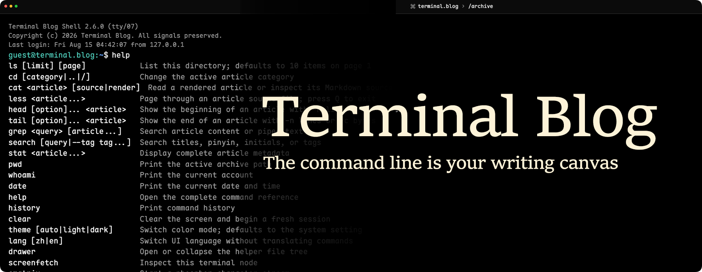
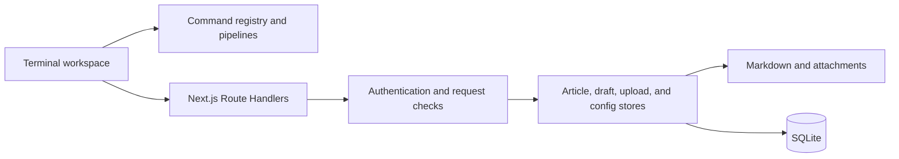

<div align="center">
  
  <h1>Terminal Blog</h1>
  <p>A blog system where the terminal is the primary interface.</p>

  <p>
    <strong>English</strong> | <a href="./README.md">简体中文</a>
  </p>

  <p>
    <a href="https://github.com/bao-cn/Terminal-Blog/actions/workflows/ci.yml"></a>
    
    
    
    <a href="./LICENSE"></a>
  </p>
</div>

<p align="center">
  
</p>

Terminal Blog maps articles, categories, drafts, attachments, configuration, and administration to a Unix-like file and command model. Visitors read Markdown as if they were browsing a filesystem; administrators can edit, publish, and maintain the site from the terminal.

```text
guest@terminal.blog:~ $ cd systems
guest@terminal.blog:~/systems $ ls
-r--r--r-- 2026-08-12  6 min packet-garden.md
guest@terminal.blog:~/systems $ cat packet-garden render
```

## Contents

- [About](#about)
- [Current Version](#current-version)
- [Features](#features)
- [Quick Start](#quick-start)
- [Docker Deployment](#docker-deployment)
- [Usage](#usage)
- [Configuration](#configuration)
- [Technical Overview](#technical-overview)
- [Development](#development)
- [Contributing and Releases](#contributing-and-releases)
- [Changelog](./CHANGELOG.md)
- [License](#license)

## About

Terminal Blog is not a command-line skin around a conventional webpage. The terminal is the workspace: command output goes into a scrollback buffer, input stays at its end, and `nano` and `less` use alternate screens that restore the previous reading position when they close.

The project is designed for visitors who enjoy a continuous, composable reading flow, while command menus, completion, help text, and a collapsible file tree keep the experience approachable.

## Current Version

`0.1.0-beta.1` is the current baseline release and includes:

- A Next.js standalone Docker image and a Compose deployment with persistent volumes.
- The shorter `config` virtual path, configurable title templates, and synchronized site metadata.
- A first-visit local-storage prompt controlled by `enable`, with `y`, `n`, and `Ctrl+C` handling.
- Terminal reading, article administration, drafts, uploads, authentication, and composable command pipelines.

See [`CHANGELOG.md`](./CHANGELOG.md) for the complete change history.

## Features

- **Terminal-first reading**: `ls`, `cd`, `cat`, `less`, `head`, `tail`, `grep`, `search`, and text pipelines.
- **In-terminal administration**: root sessions, `nano`, draft lifecycle, uploads, moves, deletion, and password changes.
- **Markdown content**: frontmatter, GFM tables and task lists, Shiki syntax highlighting, and article attachments.
- **Large scrollback without DOM growth**: TanStack Virtual renders the visible output around the viewport.
- **Bilingual experience**: language, theme, and terminal preferences persist in browser localStorage; Maple Mono loads by Unicode shard.
- **Configurable identity**: blog name, title templates, links, filing records, favicon, and the first-visit local-storage notice share one site configuration.
- **Persistent deployment**: a Next.js standalone image and Compose setup persist articles, drafts, attachments, and SQLite data.
- **Security boundaries**: revocable root sessions, atomic writes, upload signature checks, same-origin validation, body limits, and runtime schemas.

## Quick Start

### Requirements

- Node.js 24 or newer
- npm 10 or newer
- Windows, Linux, or macOS
- Native module support for `better-sqlite3` (common platforms normally use a prebuilt binary)

### Run locally

```bash
git clone https://github.com/bao-cn/Terminal-Blog.git
cd Terminal-Blog
npm install
npm run dev
```

Open <http://localhost:3000>. When the database is created for the first time without `TERMINAL_ROOT_PASSWORD`, the initial administrator credentials are `root` / `root`. Use this default only for local development.

For a production build:

```bash
npm run build
npm run start
```

### Content directories

The following directories can be prepared before starting the application and are ignored by Git by default:

```text
articles/   published Markdown articles
draft/      unpublished drafts
access/     article images and other attachments
data/       SQLite database
```

## Docker Deployment

The production image uses Next.js standalone output. Set a high-entropy password for the initial root credential, then start the service:

```bash
export TERMINAL_ROOT_PASSWORD='replace-with-a-random-secret-at-least-16-characters'
docker compose up --build -d
```

The service listens on <http://localhost:3000> by default. Set `TERMINAL_BLOG_PORT` to change the host port:

```bash
TERMINAL_BLOG_PORT=8080 docker compose up --build -d
```

Compose persists `articles/`, `draft/`, `access/`, and `data/`. Removing the container preserves the content; `docker compose down -v` removes the named volumes and their data. Production deployments should place nginx, Caddy, or another reverse proxy in front of the container for TLS and rate limiting.

`TERMINAL_ROOT_PASSWORD` is used only when the database creates the root credential for the first time. Changing the environment variable does not overwrite the stored password.

## Usage

### Visitor commands

| Command                          | Purpose                                           |
| -------------------------------- | ------------------------------------------------- |
| `help` / `man`                   | Show generated help                               |
| `ls [limit] [page]`              | List categories or paginated articles             |
| `cd [category\|..\|/]`           | Change article category                           |
| `cat <article> [render\|source]` | Render an article or print Markdown source        |
| `less <article>`                 | Read in an alternate screen; press `Q` to exit    |
| `head` / `tail`                  | Read the beginning or end of an article           |
| `grep <query> [article]`         | Search an article or piped input                  |
| `search`                         | Search by title, pinyin, tags, category, and date |
| `stat <article>`                 | Show complete metadata                            |
| `history` / `clear`              | Manage the session scrollback                     |
| `theme [auto\|light\|dark]`      | Change the theme                                  |
| `lang [zh\|en]`                  | Change the interface language                     |
| `drawer` / `tree`                | Expand or collapse the file tree                  |

Commands can be composed with pipelines:

```text
cat packet-garden source | grep network
head -n 30 packet-garden | grep latency
tail -c 512 packet-garden | grep signal
```

Type `/` to open the command menu, press `Tab` for completion, and use the arrow keys to navigate suggestions and history. `Ctrl+Shift+C`, `Ctrl+Shift+V`, and middle-click provide terminal-style copy and paste.

### Administrator commands

```text
su root                         enter a root session
sudo <command>                  authenticate and run one root command
nano <article>                  create or edit an article
draft new|list|edit|publish|rm  manage drafts
mkdir <category>                create a top-level category
mv <article> <category>         move an article
rm <article>                    remove an article and its index entry
upload <file> <target_path>     upload Markdown or an attachment
passwd                          change the password and revoke old sessions
email [address]                 read or update the contact email
```

### Article format

Articles live under `articles/<category>/`, with at most one category level. The Markdown file is the source of truth; SQLite stores metadata for lists and search:

```markdown
---
title: "Example article"
slug: example-article
date: 2026-08-15
readTime: 5 min
tags: [terminal, nextjs]
excerpt: "Article summary"
---

# Article body
```

Store images and other attachments under `access/` and reference them with a relative path such as `../../access/architecture.png`.

## Configuration

The initial site configuration lives in [`config/site.config.json`](./config/site.config.json). Root can edit it through the shorter virtual path:

```text
sudo nano config
```

`config` is virtual and is not written as a file on disk; reads and writes map to SQLite's `system_config` record. Common settings look like this:

```json
{
  "blogName": "terminal.blog",
  "description": "Field notes from the command line.",
  "titleTemplate": "{BlogName} | {ArticleName}",
  "cookieNotice": {
    "enable": true,
    "message": "This site stores language, theme, and terminal preferences locally."
  }
}
```

- `titleTemplate` supports `{BlogName}` and `{ArticleName}`. It drives server metadata and the browser tab; before an article is opened, `{ArticleName}` uses the site description, and after an article is opened it uses the article title.
- `cookieNotice.enable` controls the first-visit prompt. When enabled and no localStorage choice exists, the notice is appended to the end of the scrollback; enter `y` to accept, or `n` / `Ctrl+C` to decline. The choice is stored and the prompt is not shown again.
- The site configuration also supports the favicon, contact email, friendly links, ICP / public-security filing text, and a source-address fallback label.

Environment variables:

| Variable                 | Default        | Description                                                                           |
| ------------------------ | -------------- | ------------------------------------------------------------------------------------- |
| `TERMINAL_ROOT_PASSWORD` | `root`         | Used only when the root credential is first created; set a strong value in production |
| `TERMINAL_BLOG_PORT`     | `3000`         | Host port in Compose                                                                  |
| `NODE_ENV`               | Set by Next.js | Controls Secure cookies, HSTS, and development CSP                                    |

## Technical Overview

| Layer       | Technology                                         |
| ----------- | -------------------------------------------------- |
| Web         | Next.js 16 App Router, React 19, TypeScript strict |
| Styling     | Tailwind CSS 4, native CSS, Lucide React           |
| Content     | React Markdown, Remark GFM, Shiki                  |
| Interaction | TanStack React Virtual                             |
| Data        | SQLite, better-sqlite3, WAL                        |
| Quality     | ESLint 9, Prettier 3, Vitest 3                     |



## Development

```bash
npm run lint
npm test
npx tsc --noEmit --incremental false
npx prettier --check .
npm run build
```

New commands belong in `lib/command-registry.ts`. Put parsing and text processing in `lib/terminal-command-parser.ts` or a focused domain module, and add Vitest coverage for validation, aliases, pipelines, and output.

## Contributing and Releases

See [`CONTRIBUTING.md`](./CONTRIBUTING.md) for the complete policy. The essential workflow is:

1. Create a focused `feat/`, `fix/`, `docs/`, or `refactor/` branch from the latest `main`.
2. Implement and verify the change on that branch, using Conventional Commits.
3. Open a Pull Request from the feature branch to `main`; maintainers review and merge it manually.
4. When releasing, create `release/<version>` from the latest `main`; synchronize release fixes back to `main` first.

Do not commit articles, drafts, databases, local environment variables, or Agent instruction files. Do not disclose exploit details in public issues; use Private vulnerability reporting from the repository Security page.

## License

Terminal Blog is released under the [GNU General Public License v3.0 only](./LICENSE). Maple Mono is distributed under its own license; see [`public/fonts/maple-mono/LICENSE.txt`](./public/fonts/maple-mono/LICENSE.txt).
