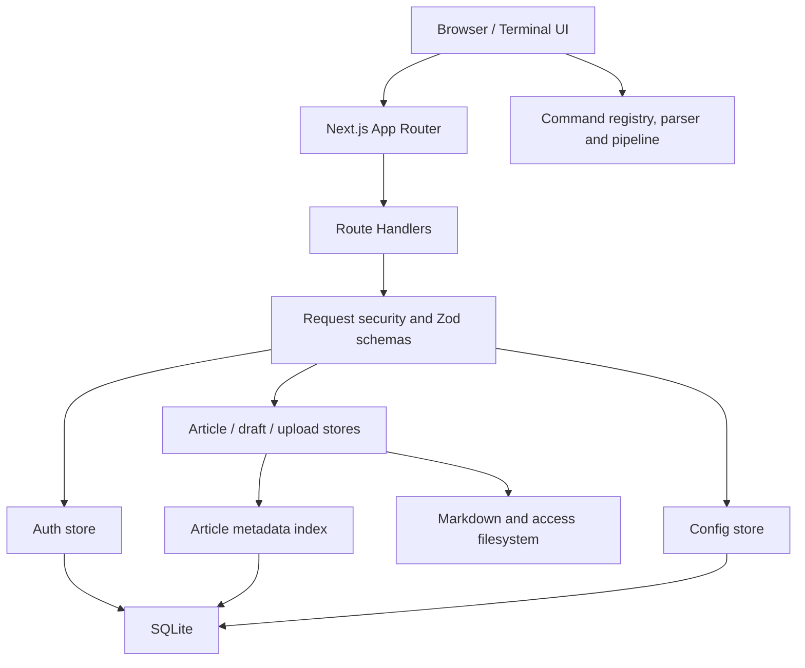

<div align="center">
  
  <h1 style="margin-top: 0">Terminal Blog</h1>
</div>

<div align="center">
  

[English](./README.en.md) | **简体中文**

    
</div>

Terminal Blog 是一个真正以终端作为主要交互界面的博客系统。它不是在普通网页外面套一层命令行皮肤，而是把文章、分类、草稿、附件、配置和管理员操作统一映射为类 Unix 文件与命令模型。

访客可以使用 `ls`、`cd`、`cat`、`less`、`head`、`tail`、`grep` 和管道符阅读内容；管理员可以通过 `su root` 或 `sudo` 使用终端内 `nano`、草稿箱、上传、移动和删除等功能维护博客。

```shell
Terminal Blog Shell 2.6.0 (tty/07)
Copyright (c) 2026 Terminal Blog. All signals preserved.
Last login: Fri Aug 15 04:42:07 from public.gateway

guest@terminal.blog:~ $ cd systems
guest@terminal.blog:~/systems $ ls
-r--r--r-- 2026-08-12  6 min packet-garden.md
guest@terminal.blog:~/systems $ cat packet-garden render
```

## 为什么是 Terminal Blog

Terminal Blog 试图同时解决两类问题：为熟悉命令行的人提供连续、可组合的阅读体验，也为不熟悉终端的访客保留命令预测、补全、帮助信息和可折叠文件树。

| 设计             | 实现与收益                                                                               |
| ---------------- | ---------------------------------------------------------------------------------------- |
| 纯终端工作区     | 页面没有传统 Header、Footer 或独立固定输入栏，命令输入始终位于回滚缓冲区末尾             |
| 可组合命令       | 命令注册表统一生成帮助、参数描述和补全信息，文本命令支持 `cat \| grep` 等管道组合        |
| 大缓冲区性能     | 使用 TanStack Virtual 渲染回滚缓冲区，仅挂载可见输出和少量 overscan 节点                 |
| 中文字体按需加载 | Maple Mono 被切分为 46 个带 `unicode-range` 的 WOFF2，浏览器只请求页面实际出现的字形区间 |
| 终端内编辑       | `nano` 和 `less` 使用备用屏幕模型，退出后恢复原回滚缓冲区位置，不弹出网页模态框          |
| 文件与索引分离   | Markdown 文件是文章正文的唯一来源，SQLite 只索引 metadata，不复制正文                    |
| 安全 Markdown    | React Markdown 禁用原始 HTML，Remark GFM 提供扩展语法，Shiki 动态加载并提供双主题高亮    |
| 可撤销认证       | root 会话使用数据库 session、密码版本和服务端撤销，不使用无法失效的纯签名令牌            |
| 可配置部署       | 博客名称、标题模板、友情链接、备案信息、图标和 Cookie 提示由统一配置模型管理             |

## 核心体验

### 终端输入模型

- 支持 `/` 打开命令菜单，单字母预测命令，`Tab` 补全，方向键选择建议和历史。
- 支持 `Insert` 在插入模式与覆盖模式之间切换。
- 密码输入不回显字符，也不显示密码长度。
- 使用 `Ctrl+Shift+C`、`Ctrl+Shift+V` 和鼠标中键执行终端式复制粘贴。
- 自定义右键菜单提供复制、粘贴、粘贴选择区、全选和清屏。
- `clear` 重建会话输出，但保留启动版权信息和新的命令输入。

### 虚拟回滚缓冲区

终端使用 `@tanstack/react-virtual` 管理输出项。当前实现采用稳定 Entry ID、动态 DOM 高度测量、约 `52px` 的初始估算和 `8` 项 overscan。

这意味着文章、命令历史、screenfetch 和 Markdown 输出持续增长时，浏览器不需要同时保留所有输出 DOM。虚拟列表只渲染当前视口附近的内容，同时仍允许输入组件跟随缓冲区末尾，并在退出 `nano` 或 `less` 后恢复滚动位置。

### Maple Mono Unicode 分片

完整 Maple Mono 中文字体体积较大，一次加载会导致首屏系统字体与 Web Font 突然切换。项目将字体拆分为 46 个 WOFF2：

- ASCII 分片约 34 KB，并在页面启动时预加载。
- Latin Extended、Symbols、CJK 标点和全角字符使用独立分片。
- CJK Unified Ideographs 以约 512 个码位为区间切分，例如 `U+4E00-4FFF`、`U+5000-51FF`。
- 所有分片合计约 6.4 MB，但浏览器只下载当前页面出现字符所覆盖的区间。

分片声明位于 [`app/maple-mono.css`](./app/maple-mono.css)，字体文件位于 `public/fonts/maple-mono/`。这种设计降低了初始字体阻塞时间，同时保留 Maple Mono 的中英文一致性。

### Markdown 与代码高亮

- `react-markdown` 负责 React 渲染，不注入 Vue 或外部渲染运行时。
- `remark-gfm` 支持表格、删除线、任务列表和自动链接。
- `skipHtml` 禁止文章中的原始 HTML。
- Shiki Web Bundle 仅在出现 fenced code block 时动态加载。
- Shiki 同时生成 `github-light` 与 `github-dark` 主题颜色，跟随终端主题切换。
- 图片默认懒加载，文章相对路径可以安全解析到白名单 `access/` 资源。

## 技术栈

| 层级      | 技术                                   |
| --------- | -------------------------------------- |
| Web 框架  | Next.js 16 App Router、React 19        |
| 开发语言  | TypeScript 5，`strict: true`           |
| UI 与样式 | Tailwind CSS 4、原生 CSS、Lucide React |
| 虚拟列表  | TanStack React Virtual                 |
| Markdown  | React Markdown、Remark GFM、Shiki      |
| 数据库    | SQLite、better-sqlite3、WAL            |
| 校验      | Zod 4                                  |
| 代码质量  | ESLint 9、Prettier 3、Vitest 3         |

## 快速开始

### 环境要求

- Node.js 24 或更高版本
- npm 10 或更高版本
- Windows、Linux 或 macOS
- 用于编译或安装 `better-sqlite3` 的原生模块支持；主流平台通常直接使用预编译包

### 安装与开发

```bash
git clone <your-fork-url>
cd terminal_blog
npm install
npm run dev
```

访问 <http://localhost:3000>。

### 生产构建

```bash
npm run build
npm run start
```

生产部署应提供持久化的 `articles/`、`draft/`、`access/` 和 `data/` 目录。只部署无状态容器但不挂载这些目录会导致文章、附件或数据库在重新部署后丢失。

## 默认管理员与安全提示

首次创建数据库且没有设置 `TERMINAL_ROOT_PASSWORD` 时：

```text
用户名: root
密码: root
```

进入 root 会话：

```text
su root
```

执行一次提权命令：

```text
sudo nano article.md
```

登录后执行 `passwd` 可以修改密码。生产环境必须在第一次启动之前提供高熵密码：

```bash
TERMINAL_ROOT_PASSWORD=replace-with-a-random-secret-at-least-16-characters
```

默认密码 `root` 仅用于本地初始化，不满足生产安全要求。

认证实现包括：

- 异步 `scrypt` 密码哈希，避免同步哈希阻塞 Node.js 事件循环。
- IP 与全局登录频率限制及指数退避。
- 随机不透明 session token，数据库只保存 SHA-256 摘要。
- session 过期、撤销、密码版本和未来时间校验。
- 修改密码会撤销所有旧 session。
- HttpOnly、SameSite=Strict Cookie，生产环境自动添加 Secure。
- mutation API 的同源检查、请求大小限制、Content-Type 检查和 Zod 运行时校验。

## 内容模型

### 文章目录

文章放入 `articles/<category>/`，只支持一级分类：

```text
articles/
  systems/
    packet-garden.md
  field-notes/
    local-first-sunday.md
```

文章使用 frontmatter：

```markdown
---
title: "Example article"
slug: example-article
date: 2026-08-15
readTime: 5 min
tags: [terminal, nextjs]
pinyin: example article
excerpt: "Article summary"
---

# Article body


```

正文只保存在 Markdown 文件中。SQLite `article_index` 保存 slug、标题、分类、日期、阅读时间、标签、拼音和源文件路径。每次扫描文章时会全量同步索引，并清理磁盘上已经不存在的记录。

### 草稿与附件

- `draft/` 保存未发布 Markdown 草稿。
- `access/` 保存文章图片。
- `upload` 只允许写入 `articles/` 或 `access/` 白名单路径。
- 附件上传校验扩展名、MIME 类型和实际文件签名。
- 文件写入使用同目录临时文件、`fsync` 和原子替换，写入失败时保留旧文件。

### 站点配置

默认配置文件为 `config/site.config.json`。root 可以通过虚拟路径编辑站点配置：

```text
sudo nano config
```

虚拟文件并不实际存在于磁盘；读取和保存 `config` 会映射到 SQLite `system_config`。配置包括：

- 博客名称与描述
- `{BlogName}`、`{ArticleName}` 标题模板
- 网站图标
- 联系邮箱
- ICP 与公安备案信息
- 友情链接
- Cookie / 本地存储提示开关与文案
- 访问来源回退名称

Cookie 提示使用以下结构：

```json
{
  "cookieNotice": {
    "enable": true,
    "message": "本站使用本地存储保存语言、主题和终端偏好。"
  }
}
```

启用后，尚未选择的访客会在首次进入时于回滚缓冲区末尾看到提示。输入 `y` 表示同意，输入 `n` 或按 `Ctrl+C` 表示拒绝；选择会保存到 localStorage，后续访问不再重复提示。旧版字符串形式的 `cookieNotice` 仍可读取，并按启用状态处理。

标题模板会同时用于服务端 metadata 和浏览器标签标题。未打开文章时，`{ArticleName}` 使用站点 `description`；通过 `cat` 或 `less` 打开文章后，它会替换为文章标题，`{BlogName}` 始终使用当前博客名称。

## 命令系统

### 访客命令

| 命令                             | 说明                                       |
| -------------------------------- | ------------------------------------------ |
| `help` / `man`                   | 查看由注册表自动生成的帮助                 |
| `ls [limit] [page]`              | 查看分类或分页文章列表                     |
| `cd [category\|..\|/]`           | 切换文章分类                               |
| `cat <article> [render\|source]` | 渲染 Markdown 或输出源文件                 |
| `less <article>`                 | 使用备用屏幕分页查看，按 `Q` 退出          |
| `head` / `tail`                  | 按行数或字节数查看文章开头、末尾           |
| `grep <query> [article]`         | 搜索文章或管道输入                         |
| `search`                         | 按标题、拼音、首字母、标签、分类和日期搜索 |
| `stat <article>`                 | 查看完整 metadata                          |
| `history` / `clear`              | 管理会话回滚缓冲区                         |
| `theme [auto\|light\|dark]`      | 切换主题                                   |
| `lang [zh\|en]`                  | 切换界面语言，命令名不翻译                 |
| `drawer` / `tree`                | 展开或折叠辅助文件树                       |
| `screenfetch`                    | 输出浏览器、内核、GPU、内存和设备信息      |

文本命令支持管道：

```text
cat packet-garden source | grep network
head -n 30 packet-garden | grep latency
tail -c 512 packet-garden | grep signal
```

### 管理员命令

| 命令                                 | 说明                           |
| ------------------------------------ | ------------------------------ |
| `su root` / `exit`                   | 进入或退出 root 会话           |
| `sudo <command>`                     | 验证密码并执行单次 root 命令   |
| `nano <article>`                     | 在终端内创建或编辑文章         |
| `draft new\|list\|edit\|publish\|rm` | 管理草稿生命周期               |
| `mkdir <category>`                   | 新建一级分类                   |
| `mv <article> <category>`            | 移动文章                       |
| `rm <article>`                       | 删除文章及对应索引             |
| `upload <file> <target_path>`        | 上传 Markdown 或图片           |
| `passwd`                             | 修改 root 密码并撤销旧 session |
| `email [address]`                    | 查看或修改联系邮箱             |

彩蛋命令包括 `cmatrix`、`hollywood`、`cbonsai`、`cowsay` 和 `nyancat`。它们与普通命令一样直接写入回滚缓冲区。

### 扩展新命令

1. 在 `lib/command-registry.ts` 注册命令、别名、权限和参数定义。
2. 把纯解析或文本处理逻辑放入 `lib/terminal-command-parser.ts` 或独立领域模块。
3. 在终端控制器中连接需要 React 状态或 API 的执行逻辑。
4. 为参数验证、别名、管道或输出增加 Vitest 测试。
5. `help`、命令菜单和参数提示会自动读取注册表，不需要维护第二份帮助文本。

## 系统架构



### 分层职责

| 层级       | 主要文件                                                                                    | 职责                                                  |
| ---------- | ------------------------------------------------------------------------------------------- | ----------------------------------------------------- |
| 页面入口   | `app/page.tsx`、`app/layout.tsx`                                                            | SSR 初始数据、Metadata、全局字体预加载                |
| 终端工作区 | `components/TerminalBlog.tsx`                                                               | 会话状态、命令调度、回滚缓冲区和 Drawer 协调          |
| 终端组件   | `components/terminal/*`                                                                     | Prompt、Markdown、nano、less、screenfetch、右键菜单   |
| 命令领域   | `lib/command-registry.ts`、`terminal-command-parser.ts`、`terminal-text-pipeline.ts`        | 注册、补全、参数计算、管道解析和纯文本执行            |
| API 安全   | `lib/request-security.ts`、`api-schemas.ts`                                                 | 同源、大小限制、Content-Type、错误响应和运行时 Schema |
| 数据访问   | `auth-store.ts`、`article-store.ts`、`draft-store.ts`、`upload-store.ts`、`config-store.ts` | 分域的数据读写和授权边界                              |
| 持久化     | `database.ts`、`article-index-store.ts`、`atomic-file.ts`                                   | SQLite 迁移、metadata 索引和原子文件更新              |

### 请求与状态流

1. 服务端每次页面请求读取站点配置、文章目录、分类和附件列表。
2. 客户端只把主题、语言、Cookie 提示选择和配置 MD5 保存到 localStorage；文章不从 localStorage 恢复，服务端数据始终是权威来源。
3. mutation 请求经过同源检查、认证、请求大小限制和 Zod 校验。
4. 文件系统写入成功后同步 SQLite metadata 索引。
5. 客户端在服务端确认成功之后更新文章状态，避免无回滚的乐观更新。

## 项目目录

```text
app/                      Next.js 页面、API 和全局样式
  api/                    auth、articles、drafts、upload、config
  maple-mono.css          46 个 Unicode-range 字体声明
components/
  terminal/               可复用终端视图与备用屏幕组件
lib/
  command-registry.ts     命令定义、参数与自动帮助
  terminal-*.ts           命令解析和可测试的管道执行
  *-store.ts              分域数据访问层
  request-security.ts     请求安全边界
  database.ts             SQLite 建表与迁移
public/fonts/maple-mono/  字体 WOFF2 分片
articles/                 发布文章，默认被 Git 忽略
draft/                    草稿，默认被 Git 忽略
access/                   文章附件
data/                     SQLite 数据，默认被 Git 忽略
config/                   初始站点配置
tests/                    Vitest 单元测试
.github/                  CI、Issue 表单和 PR 模板
```

## 配置与环境变量

| 变量                     | 必需            | 默认值        | 说明                                |
| ------------------------ | --------------- | ------------- | ----------------------------------- |
| `TERMINAL_ROOT_PASSWORD` | 否              | `root`        | 仅在第一次创建 root 凭据时使用      |
| `NODE_ENV`               | 由 Next.js 设置 | `development` | 控制 Secure Cookie、HSTS 和开发 CSP |

站点内容配置不使用 Next.js 静态缓存。页面请求会读取 SQLite 或初始 JSON，并生成 MD5 供客户端判断配置是否发生变化。

## Docker 部署

项目使用 Next.js standalone 输出构建生产镜像。先设置首次初始化 root 凭据所需的高强度密码，再启动服务：

```bash
export TERMINAL_ROOT_PASSWORD='replace-with-a-random-secret-at-least-16-characters'
docker compose up --build -d
```

默认监听 `http://localhost:3000`。可通过 `TERMINAL_BLOG_PORT` 修改宿主机端口。Compose 使用命名卷持久化 `articles/`、`draft/`、`access/` 和 `data/`；删除容器不会删除这些内容，执行 `docker compose down -v` 才会移除卷和其中的数据。

生产环境应在容器前部署 nginx、Caddy 等反向代理，并由代理处理 TLS、请求限速和异常连接。`TERMINAL_ROOT_PASSWORD` 只在数据库首次创建 root 凭据时生效，之后修改环境变量不会覆盖已有密码。

## 开发与质量检查

```bash
npm run lint
npm test
npx tsc --noEmit --incremental false
npx prettier --check .
npm run build
```

测试覆盖文章 frontmatter、API Schema、请求大小与同源策略、session 时间策略、命令注册与管道执行。新增功能应根据风险补充单元测试或 Route Handler 集成测试。

## 贡献流程

完整规范见 [CONTRIBUTING.md](./CONTRIBUTING.md)。标准流程如下：

1. 先搜索现有 Issue，确认问题或方案尚未被跟踪。
2. Bug 使用 Bug Report 表单并提供可复现步骤、浏览器、系统和日志；功能建议使用 Feature Request 表单说明终端语义和使用场景。
3. Fork 仓库，从最新默认分支创建 `fix/<topic>`、`feat/<topic>`、`docs/<topic>` 或 `refactor/<topic>` 分支。
4. 安装依赖并先运行现有测试，确认基线正常。
5. 修改应保持单一职责，不提交 `articles/`、`draft/`、`data/`、本地环境变量或 Agent 指令文件。
6. 新命令必须通过命令注册表接入；不要维护独立的硬编码帮助列表。
7. 提交前运行全部质量命令，并验证 `http://localhost:3000` 的主要终端流程。
8. Commit 推荐使用 Conventional Commits，例如 `feat(commands): add wc command`。
9. Pull Request 说明动机、实现、风险、验证结果和 UI 变化；可视变化需要提供截图或录屏。
10. 评审意见通过新增提交处理，不重写已经进入评审的公共历史；合并前确保 CI 通过且讨论已解决。

安全漏洞不要提交包含利用细节、密码、token 或真实数据的公开 Issue。请使用 GitHub 仓库 Security 页面中的 Private vulnerability reporting。

## GitHub 自动化

- `CI` 工作流在 push 和 Pull Request 上运行 Prettier、ESLint、TypeScript、Vitest 和生产构建。
- `Dependency Review` 在 Pull Request 中检查新增依赖的已知漏洞与许可证风险。
- Issue Forms 会强制收集复现信息、运行环境和需求动机。
- Pull Request 模板要求填写验证项、风险和可视变化。

## 数据备份

Git 默认忽略文章、草稿和数据库。升级或迁移前至少备份：

```text
articles/
draft/
access/
data/terminal-blog.sqlite
```

SQLite 使用 WAL 模式。在线复制数据库时需要使用 SQLite backup API 或同时处理 `-wal`、`-shm` 文件；最稳妥的方式是在停止写入后执行备份。

## 许可证

Terminal Blog 使用 [GNU General Public License v3.0 only](./LICENSE) 发布。

Maple Mono 字体使用其自身许可证，详见 [`public/fonts/maple-mono/LICENSE.txt`](./public/fonts/maple-mono/LICENSE.txt)。
