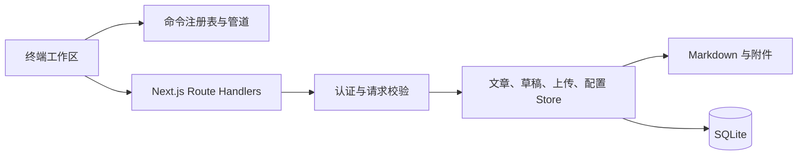

<div align="center">
  
  <h1>Terminal Blog</h1>
  <p>一个真正以终端为主要交互界面的博客系统。</p>

  <p>
    <a href="./README.en.md">English</a> | <strong>简体中文</strong>
  </p>

  <p>
    <a href="https://github.com/bao-cn/Terminal-Blog/actions/workflows/ci.yml"></a>
    
    
    
    <a href="./LICENSE"></a>
  </p>
</div>

<p align="center">
  
</p>

Terminal Blog 把文章、分类、草稿、附件、配置和管理员操作映射为类 Unix 文件与命令。访客可以像浏览文件系统一样阅读 Markdown 文章，管理员可以在终端内完成编辑、发布和维护。

```text
guest@terminal.blog:~ $ cd systems
guest@terminal.blog:~/systems $ ls
-r--r--r-- 2026-08-12  6 min packet-garden.md
guest@terminal.blog:~/systems $ cat packet-garden render
```

## 目录

- [关于](#关于)
- [当前版本](#当前版本)
- [功能](#功能)
- [用户部署](#用户部署)
- [快速开始](#快速开始)
- [使用指南](#使用指南)
- [配置](#配置)
- [技术概览](#技术概览)
- [开发与检查](#开发与检查)
- [贡献与发布](#贡献与发布)
- [更新记录](./CHANGELOG.md)
- [许可证](#许可证)

## 关于

Terminal Blog 不是普通网页套一层命令行皮肤，而是把终端作为主要工作区：命令输出进入滚动缓冲区，输入始终位于缓冲区末尾，`nano` 和 `less` 使用备用屏幕，退出后回到原来的阅读位置。

项目适合希望体验连续、可组合阅读流程的访客，也为不熟悉终端的用户提供命令菜单、补全、帮助信息和可折叠文件树。

## 当前版本

`0.1.0-beta.1` 是当前基线版本，包含：

- Next.js standalone Docker 镜像与 Compose 持久化部署。
- `config` 虚拟配置路径、可配置标题模板和站点元数据同步。
- 可通过 `enable` 开关控制的首访本地存储提示，支持 `y`、`n` 和 `Ctrl+C`。
- 终端阅读、文章管理、草稿、上传、认证和可组合命令管道。

完整变更记录见 [`CHANGELOG.md`](./CHANGELOG.md)。

## 功能

- **终端优先阅读**：支持 `ls`、`cd`、`cat`、`less`、`head`、`tail`、`grep`、`search` 和文本管道。
- **终端内维护**：root 会话支持 `nano`、草稿生命周期、上传、移动、删除和密码修改。
- **Markdown 内容**：支持 frontmatter、GFM 表格与任务列表、Shiki 代码高亮和文章附件。
- **流畅的大缓冲区**：使用 TanStack Virtual 渲染可见滚动内容，避免历史输出持续增长导致 DOM 膨胀。
- **中英文体验**：界面语言、主题和终端偏好可保存到浏览器 localStorage；Maple Mono 使用 Unicode 分片按需加载。
- **可配置站点**：博客名称、标题模板、友情链接、备案信息、图标和首访本地存储提示统一由站点配置管理。
- **可持久化部署**：提供 Next.js standalone Docker 镜像和 Compose 配置，文章、草稿、附件与 SQLite 数据使用持久化卷。
- **安全边界**：root session 可撤销，写入采用原子替换，上传校验文件签名，mutation API 具备同源、大小和 Schema 校验。

## 用户部署

以下步骤面向只想运行博客的用户，不要求了解 Next.js 或项目代码。首次部署前，请准备一个用于 root 管理员的高强度密码；不要在生产环境使用默认密码 `root`。

### 方式一：手动部署

适用于不使用 Docker、希望直接在 Windows、Linux 或 macOS 上运行的场景。

1. 安装 [Node.js 24 或更高版本](https://nodejs.org/)，安装程序会同时提供 npm。
2. 在 GitHub 仓库中点击 **Code → Download ZIP**，解压到一个固定目录，例如 `terminal-blog`。
3. 在该目录打开 PowerShell、终端或命令提示符，安装依赖：

   ```bash
   npm install
   ```

4. 设置首次初始化管理员密码。PowerShell 使用：

   ```powershell
   $env:TERMINAL_ROOT_PASSWORD = "replace-with-a-random-secret-at-least-16-characters"
   ```

   Linux 或 macOS 使用：

   ```bash
   export TERMINAL_ROOT_PASSWORD='replace-with-a-random-secret-at-least-16-characters'
   ```

5. 创建生产版本并启动：

   ```bash
   npm run build
   npm run start
   ```

6. 浏览器打开 <http://localhost:3000>。运行博客的终端窗口需要保持开启；停止服务时按 `Ctrl+C`。

应用会在运行目录中保存以下内容，请定期备份：

```text
articles/   已发布文章
draft/      草稿
access/     图片和其他附件
data/       SQLite 数据库
```

更新手动部署时，先备份上述目录并按 `Ctrl+C` 停止服务，再替换项目文件，重新执行 `npm install`、`npm run build` 和 `npm run start`。不要删除或覆盖这些内容目录。

### 方式二：Docker 部署

适用于已经安装 Docker Desktop（Windows、macOS）或 Docker Engine 与 Compose v2（Linux）的场景。Docker 会自动处理 Node.js 和原生依赖，推荐普通用户使用此方式。

1. 安装 [Docker Desktop](https://www.docker.com/products/docker-desktop/) 或 Docker Engine，并确认 `docker compose version` 可以正常运行。
2. 下载并解压项目 ZIP，在项目目录中创建 `.env` 文件：

   ```dotenv
   TERMINAL_ROOT_PASSWORD=replace-with-a-random-secret-at-least-16-characters
   TERMINAL_BLOG_PORT=3000
   ```

   `.env` 只保存在本机，不要提交或公开其中的密码。

3. 在项目目录执行：

   ```bash
   docker compose up --build -d
   ```

4. 浏览器打开 <http://localhost:3000>。如果修改了 `TERMINAL_BLOG_PORT`，请访问对应端口。

常用管理命令：

```bash
docker compose ps              # 查看运行状态
docker compose logs -f         # 查看实时日志，按 Ctrl+C 退出日志查看
docker compose stop            # 停止容器，保留数据
docker compose up -d --build   # 更新镜像并重新启动
```

Compose 会把 `articles/`、`draft/`、`access/` 和 `data/` 保存到命名卷中。`docker compose stop` 或删除容器不会删除数据；`docker compose down -v` 会删除命名卷及其中的所有文章、附件和数据库，只有在确认要清空站点时才执行。

## 快速开始

以下内容面向需要修改代码、运行开发服务器的贡献者。

### 环境要求

- Node.js 24 或更高版本
- npm 10 或更高版本
- Windows、Linux 或 macOS
- 能够安装 `better-sqlite3` 原生模块的环境（主流平台通常使用预编译包）

### 本地运行

```bash
git clone https://github.com/bao-cn/Terminal-Blog.git
cd Terminal-Blog
npm install
npm run dev
```

打开 <http://localhost:3000>。首次创建数据库时，如果没有设置 `TERMINAL_ROOT_PASSWORD`，初始管理员凭据为 `root` / `root`，仅适用于本地开发。

生产构建可以使用：

```bash
npm run build
npm run start
```

### 本地内容目录

运行前可以准备以下目录；它们在 Git 中默认被忽略：

```text
articles/   已发布的 Markdown 文章
draft/      未发布的草稿
access/     文章图片和其他附件
data/       SQLite 数据库
```

## 使用指南

### 访客命令

| 命令                             | 作用                               |
| -------------------------------- | ---------------------------------- |
| `help` / `man`                   | 查看自动生成的帮助                 |
| `ls [limit] [page]`              | 查看分类或分页文章                 |
| `cd [category\|..\|/]`           | 切换文章分类                       |
| `cat <article> [render\|source]` | 渲染文章或输出 Markdown 源码       |
| `less <article>`                 | 在备用屏幕中分页阅读，按 `Q` 退出  |
| `head` / `tail`                  | 查看文章开头或末尾                 |
| `grep <query> [article]`         | 搜索文章或管道输入                 |
| `search`                         | 按标题、拼音、标签、分类和日期搜索 |
| `stat <article>`                 | 查看完整 metadata                  |
| `history` / `clear`              | 管理会话滚动缓冲区                 |
| `theme [auto\|light\|dark]`      | 切换主题                           |
| `lang [zh\|en]`                  | 切换界面语言                       |
| `drawer` / `tree`                | 展开或折叠辅助文件树               |

命令支持管道组合：

```text
cat packet-garden source | grep network
head -n 30 packet-garden | grep latency
tail -c 512 packet-garden | grep signal
```

输入 `/` 打开命令菜单，按 `Tab` 补全，方向键选择建议和历史。`Ctrl+Shift+C`、`Ctrl+Shift+V` 和鼠标中键提供终端式复制粘贴。

### 管理员命令

```text
su root                         进入 root 会话
sudo <command>                  验证密码并执行单次 root 命令
nano <article>                  创建或编辑文章
draft new|list|edit|publish|rm  管理草稿
mkdir <category>                新建一级分类
mv <article> <category>         移动文章
rm <article>                    删除文章及索引
upload <file> <target_path>     上传 Markdown 或附件
passwd                          修改密码并撤销旧 session
email [address]                 查看或修改联系邮箱
```

### 文章格式

文章放在 `articles/<category>/`，分类最多一级。正文保存在 Markdown 文件中，SQLite 只保存用于列表和搜索的 metadata：

```markdown
---
title: "Example article"
slug: example-article
date: 2026-08-15
readTime: 5 min
tags: [terminal, nextjs]
excerpt: "Article summary"
---

# Article body
```

图片等附件放在 `access/`，文章中使用相对路径引用，例如 `../../access/architecture.png`。

## 配置

初始站点配置位于 [`config/site.config.json`](./config/site.config.json)。root 可以通过较短的虚拟路径编辑它：

```text
sudo nano config
```

`config` 是虚拟文件，不会作为文件写入磁盘；读取和保存会映射到 SQLite 的 `system_config`。常用配置如下：

```json
{
  "blogName": "terminal.blog",
  "description": "Field notes from the command line.",
  "titleTemplate": "{BlogName} | {ArticleName}",
  "cookieNotice": {
    "enable": true,
    "message": "本站使用本地存储保存语言、主题和终端偏好。"
  }
}
```

- `titleTemplate` 支持 `{BlogName}` 和 `{ArticleName}`。它同时用于服务端 metadata 和浏览器标签；未打开文章时，`{ArticleName}` 使用站点描述，打开文章后使用文章标题。
- `cookieNotice.enable` 控制首访提示。启用且 localStorage 没有选择时，提示会追加到滚动缓冲区末尾；输入 `y` 同意，输入 `n` 或按 `Ctrl+C` 拒绝。选择保存后不会重复提示。
- 站点配置还支持 favicon、联系邮箱、友情链接、ICP / 公安备案信息和来源地址回退名称。

环境变量：

| 变量                     | 默认值          | 说明                                                     |
| ------------------------ | --------------- | -------------------------------------------------------- |
| `TERMINAL_ROOT_PASSWORD` | `root`          | 仅在第一次创建 root 凭据时使用；生产环境必须设置高强度值 |
| `TERMINAL_BLOG_PORT`     | `3000`          | Compose 映射到宿主机的端口                               |
| `NODE_ENV`               | 由 Next.js 设置 | 控制 Secure Cookie、HSTS 和开发 CSP                      |

## 技术概览

| 层级 | 技术                                               |
| ---- | -------------------------------------------------- |
| Web  | Next.js 16 App Router、React 19、TypeScript strict |
| 样式 | Tailwind CSS 4、原生 CSS、Lucide React             |
| 内容 | React Markdown、Remark GFM、Shiki                  |
| 交互 | TanStack React Virtual                             |
| 数据 | SQLite、better-sqlite3、WAL                        |
| 质量 | ESLint 9、Prettier 3、Vitest 3                     |



## 开发与检查

```bash
npm run lint
npm test
npx tsc --noEmit --incremental false
npx prettier --check .
npm run build
```

新增命令请在 `lib/command-registry.ts` 注册；解析和文本处理逻辑放在 `lib/terminal-command-parser.ts` 或独立领域模块，并为参数验证、别名、管道和输出补充 Vitest 测试。

## 贡献与发布

完整规范见 [`CONTRIBUTING.md`](./CONTRIBUTING.md)。贡献流程的关键约定：

1. 从最新 `main` 创建单一职责的 `feat/`、`fix/`、`docs/` 或 `refactor/` 特性分支。
2. 在特性分支完成实现和检查，提交使用 Conventional Commits。
3. 特性分支提交 Pull Request 到 `main`，由维护者 Code Review 并手动合并。
4. 发布时从最新 `main` 创建 `release/<version>` 分支；发布修复先同步回 `main`。

请不要提交文章、草稿、数据库、本地环境变量或 Agent 指令文件。安全漏洞不要公开提交利用细节，请使用 GitHub Security 页面中的 Private vulnerability reporting。

## 许可证

Terminal Blog 使用 [GNU General Public License v3.0 only](./LICENSE) 发布。Maple Mono 字体使用其自身许可证，详见 [`public/fonts/maple-mono/LICENSE.txt`](./public/fonts/maple-mono/LICENSE.txt)。
